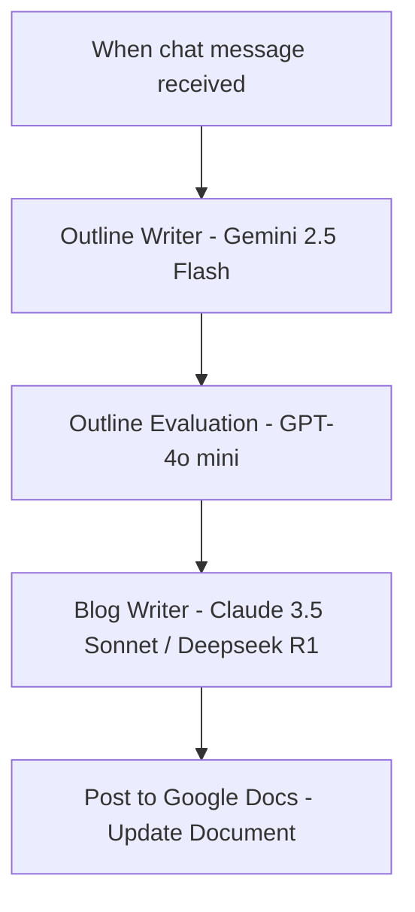
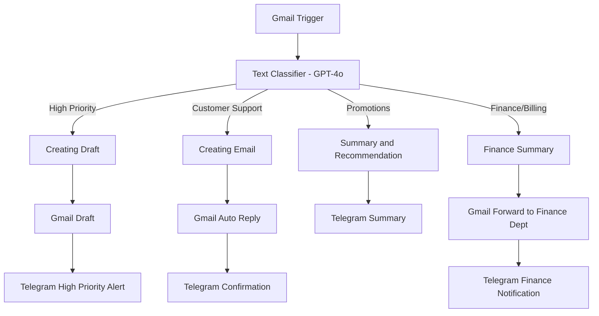
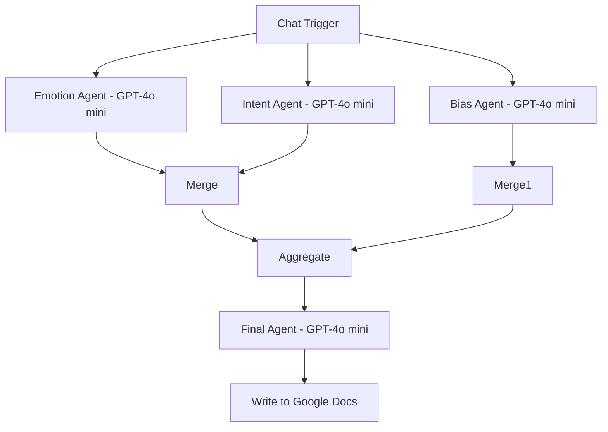
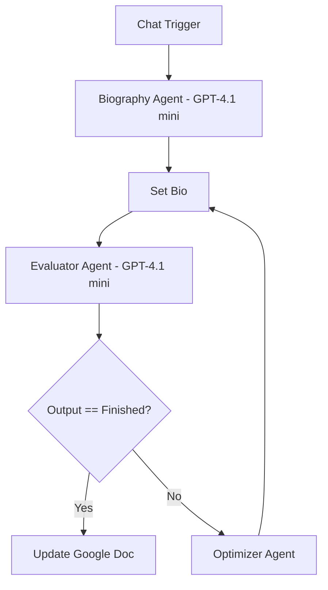

# Agentic Frameworks

These are **four powerful agentic workflows** you can use for different automation and AI use cases.  
Each framework focuses on a unique strategy — choose the one that best fits your problem or combine them for advanced solutions.

# Table of Contents

1. [Agentic Framework - Prompt Chaining](#1-agentic-framework---prompt-chaining)  
2. [Agentic Framework - Routing](#2-agentic-framework---routing)  
3. [Agentic Framework - Parallelization](#3-agentic-framework---parallelization)  
4. [Agentic Framework - Evaluator Optimizer](#4-agentic-framework---evaluator-optimizer)  

---

[](https://www.youtube.com/watch?v=OtPRPE97Kng)

---

# 1. Agentic Framework - Prompt Chaining

  

## Overview

Prompt Chaining breaks a complex content-generation task into smaller, focused steps (agents). Each agent performs a single responsibility — outline generation, outline evaluation, and full content writing — and the outputs flow from one agent to the next. This improves accuracy, control, and reusability.

## Workflow Image


## Mermaid Diagram



## Node-by-node configuration

1. **Step 1 — Chat Trigger**

   * Entry point — accepts user topic or chat input.
2. **Step 2 — AI Agent: Outline Writer**

   * Model: Gemini 2.5 Flash
   * Prompt: `Here is the topic to write a blog about: {{ $json.chatInput }}`
   * System Message:

     ```text
     ## Overview
     You are an expert outline writer. Your job is to generate a structured outline for a blog post with section titles and key points
     ```
3. **Step 3 — AI Agent: Outline Evaluation**

   * Model: GPT-4o mini
   * Prompt: `Here is the outline: {{ $json.output }}`
   * System Message:

     ```text
     ## Overview
     You are an expert blog evaluator. Revise this outline and ensure it covers the following key criteria:
     (1) Engaging Introduction
     (2) Clear Section Breakdown
     (3) Logical Flow
     (4) Conclusion with key takeaways

     ## Output
     Only output the revised outline
     ```
4. **Step 4 — AI Agent: Blog Writer**

   * Model: Claude 3.5 Sonnet / Deepseek R1
   * Prompt: `Here is the revised Outline: {{ $json.output }}`
   * System Message:

     ```text
     # Overview
     You are an expert blog writer. Generate a detailed blog post using the outline with well-structured paragraphs and engaging contents.
     ```
5. **Step 5 — Google Docs: Post to Docs**

   * Operation: Update document (Insert at end)
   * Doc URL: `https://docs.google.com/document/d/1nbI3RVYy3pF4P2vO0Ng5OVnzAblnMcs6FeAXYet-qQo/edit?tab=t.0`
   * Action: Insert text `{{ $json.output }}`

## Benefits

* Improved accuracy & quality
* Greater control
* Specialization
* Easier debugging
* Scalable & reusable

## Model selection rationale

* Gemini 2.5 Flash → outline generation
* GPT-4o mini → outline evaluation
* Claude 3.5 Sonnet / Deepseek R1 → final blog writing

## Free template

- **Download**: [Prompt Chaining Workflow Template](https://github.com/SachinSavkare/4-Agentic-Framework-/blob/main/10.1%20Prompt%20Chaining%20_%20Agentic%20Framework.json)

---

# 2. Agentic Framework - Routing

   

## Overview

The Routing workflow powers an **Inbox Management Agent** that classifies incoming emails, drafts responses, summarizes content, forwards finance mails, and sends Telegram notifications. Built on **n8n**, it makes your inbox smarter and more organized.

## Workflow Image


## Mermaid Diagram



## Node-by-node configuration

1. **Step 1 — Gmail Trigger**

   * Incoming emails trigger workflow.
2. **Step 2 — Text Classifier**

   * Model: GPT-4o
   * Routes emails into categories: High Priority, Customer Support, Promotions, Finance/Billing.

### Category 1 — High Priority Emails

1. Gmail Node: Add label "High Priority".
2. AI Agent (Executive Assistant)

   * System Message:

     ```text
     You are an executive assistant. Respond to incoming high priority emails accurately.
     ```
   * Output: Subject, Message, From, Telegram Text.
3. Gmail Node: Create draft.
4. Telegram Node: Send alert `HIGH PRIORITY EMAIL from {{ From }}. Draft created with subject {{ Subject }}`.

### Category 2 — Customer Support Emails

1. Gmail Node: Add label "Customer Support".
2. AI Agent (Customer Service Rep)

   * System Message:

     ```text
     You are a customer service representative. Respond to incoming customer support emails accurately.
     If unable to handle, refer to customersupport@abccorp.com.
     ```
   * Output: Subject, Message, From, Telegram Text.
3. Gmail Node: Auto reply.
4. Telegram Node: Send confirmation.

### Category 3 — Promotional Emails

1. Gmail Node: Add label "Promotions".
2. AI Agent (Promotions Manager)

   * System Message:

     ```text
     You are in charge of promotions. Evaluate incoming promotional emails.
     ```
   * Output: Summary, Recommendation, From, Telegram Text.
3. Telegram Node: Send summary + recommendation.

### Category 4 — Finance/Billing Emails

1. Gmail Node: Add label "Finance/Billing".
2. AI Agent (Finance Assistant)

   * System Message:

     ```text
     You are a finance/billing assistant. Summarize incoming emails concisely.
     ```
   * Output: Subject, Message, From, Telegram Text.
3. Gmail Node: Forward to finance department.
4. Telegram Node: Send finance notification.

## Benefits

* High-priority emails get immediate attention.
* Customer support emails receive auto replies.
* Promotional emails summarized with recommendations.
* Finance/Billing emails forwarded and summarized.
* Modular design → extendable to CRM or other tools.

## Free template

- **Download**: [Routing Workflow Template](https://github.com/SachinSavkare/4-Agentic-Framework-/blob/main/10.2%20Routing%20_%20Agentic%20Framework.json)

---

# 3. Agentic Framework - Parallelization


## Overview

The Parallelization workflow allows multiple AI agents to analyze a message **simultaneously** instead of sequentially. It reduces latency and ensures specialized, accurate analysis by focusing each agent on a single responsibility: emotion, intent, and bias.

## Workflow Image


## Mermaid Diagram



## Node-by-node configuration

1. **Step 1 — Chat Trigger**

   * Input: user chat message.
2. **Step 2.1 — Emotion Agent**

   * Model: GPT-4o mini
   * Prompt: `{{ $json.chatInput }}`
   * System Message:

     ```text
     Analyse the emotional tone of the incoming text. Categorize it as positive, negative, neutral or mixed. Provide a brief explanation.
     ```
3. **Step 2.2 — Intent Agent**

   * Model: GPT-4o mini
   * Prompt: `{{ $json.chatInput }}`
   * System Message:

     ```text
     Analyse the intent behind this text. Classify it as informational, persuasive, aggressive or neutral. Provide reasoning.
     ```
4. **Step 2.3 — Bias Agent**

   * Model: GPT-4o mini
   * Prompt: `{{ $json.chatInput }}`
   * System Message:

     ```text
     Analyse this text for potential biases. Identify if it exhibits political, gender, racial or other biases. Suggest ways to make it more neutral.
     ```
5. **Step 3.1 — Merge**

   * Mode: Append
   * Number of Inputs: 2
6. **Step 3.2 — Merge1**

   * Mode: Append
   * Number of Inputs: 2
7. **Step 4 — Aggregate**

   * Aggregate all item data into a single list under field `data`.
8. **Step 5 — Final Agent**

   * Model: GPT-4o mini
   * Prompt:

     ```text
     Here is the analysis: {{ $json.output }}
     ```
   * System Message:

     ```text
     Merge the incoming emotional tone, intent, and bias analysis into a structured report. Ensure it is clear, concise, and actionable.
     ```
9. **Step 6 — Google Docs: Write to Docs**

   * Operation: Update document (Insert at end)
   * Doc URL: `https://docs.google.com/document/d/1WByoaKek27VoqW1eP8xyWJPwvNliKZ_QTf69uHBaR_E/edit?tab=t.0`
   * Action: Insert text `{{ $json.output }}`

## Benefits

* ☑️ Faster Analysis — parallel agents reduce latency.
* ☑️ Specialized Agents — each focuses on a single aspect (emotion, intent, bias).
* ☑️ Comprehensive Review — final agent merges into a structured report.
* ☑️ Scalability — can add more agents (e.g., readability, factual accuracy).

## Example Input

```
I don’t trust the mainstream media anymore. They always push a specific agenda and ignore real issues. People need to wake up and stop believing everything they see on the news.
```

## Free template

- **Download**: [Parallelization Workflow Template](https://github.com/SachinSavkare/4-Agentic-Framework-/blob/main/10.3%20Parallelization%20_%20Agentic%20Framework%20(1).json)

---

# 4. Agentic Framework - Evaluator Optimizer


## Overview

The Evaluator Optimizer workflow creates, evaluates, and continuously refines biographies until they meet all criteria. It introduces an iterative feedback loop where the Evaluator Agent checks the content and, if necessary, the Optimizer Agent revises it until approval.

## Workflow Image


## Mermaid Diagram



## Node-by-node configuration

1. **Step 1 — Chat Trigger**

   * Input: user chat message.
2. **Step 2 — Biography Agent**

   * Model: GPT-4.1 mini
   * Prompt: `{{ $json.chatInput }}`
   * System Message:

     ```text
     ## Overview
     You are an expert biography writer. You will receive information about a person and your job is to create an entire profile using the information they gave you. You are allowed to be creative.
     ```
3. **Step 3 — Set Bio**

   * Mode: Manual mapping
   * Field: `bio = {{ $json.output }}`
4. **Step 4 — Evaluator Agent**

   * Model: GPT-4.1 mini
   * Prompt: `Here is the biography : {{$json.bio}}`
   * System Message:

     ```text
     ## Overview
     You are an expert biography evaluator. Your job is to provide feedback on the biography.

     ## Criteria
     - Must include a quote from the person.
     - Must be light and humorous.
     - Must not include emojis.

     ## Output
     Only output feedback. Once the biography is finished and all criteria are met, simply output "Finished".
     ```
5. **Step 5 — IF Node (Evaluate)**

   * Condition: `{{ $json.output }} == Finished`
   * If True: proceed to Step 6.1
   * If False: proceed to Step 6.2
6. **Step 6.1 — Google Docs: Update Document**

   * Operation: Update document (Insert at end)
   * Doc URL: `https://docs.google.com/document/d/1a328g-P9HLSRKZacZY-aFad1tqMXSruPIHkzE7-7t90/edit?tab=t.0`
   * Action: Insert biography text at end
7. **Step 6.2 — Optimizer Agent**

   * Prompt:

     ```text
     Biography : {{$('Set Bio').item.json.bio}}

     Feedback: {{ $('Evaluator Agent').item.json.output }}
     ```
   * System Message:

     ```text
     ## Overview
     You are an expert biography revisor. Your job is to take the biography and optimize it based on the feedback.
     ```
   * Output: Revised biography → sent back to Step 3 (Set Bio).

## Benefits

* ☑️ Ensures high-quality outputs through iterative evaluation.
* ☑️ Reduces errors and minimizes manual review.
* ☑️ Flexible and scalable — adaptable to many content types.
* ☑️ Optimizes AI performance with continuous improvement.

## Process Notes

* The Evaluator Agent ensures every biography has a quote, humor, and no emojis.
* The Optimizer Agent refines until Evaluator says "Finished".
* Inspired by "Human-in-the-loop" concept, but automated.

## Free template

- **Download**: [Parallelization Workflow Template](https://github.com/SachinSavkare/4-Agentic-Framework-/blob/main/10.4%20Evaluator-Optimizer%20_%20Agentic%20Framework.json)

---
